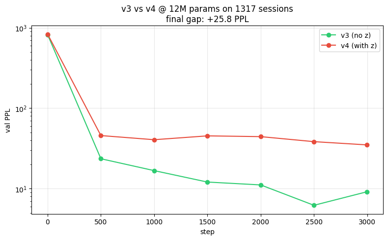
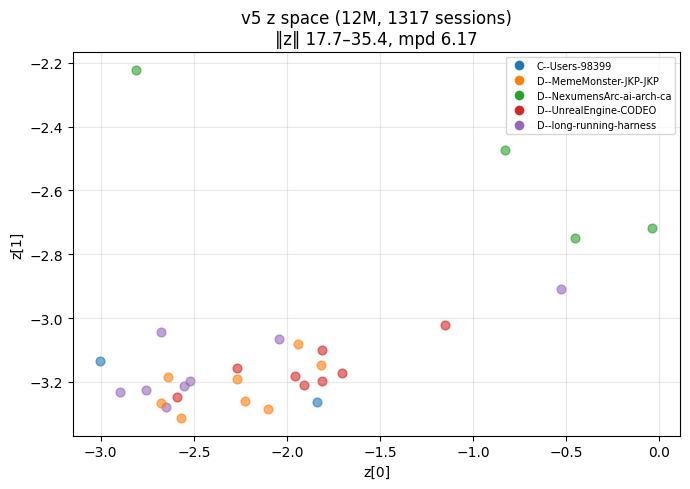

# CrystaLLM v5 — 扩规模实验 (scaled v3 vs scaled v4)

> 回答用户的关键问题："扩规模能解决 v4 的 PPL 退化吗？"

## 答案：能解决一部分，但 PPL gap 的根源不是容量

| 指标 | v3 (2M, 100) | v3 (12M, 1317) | 提升 |
|---|---:|---:|---:|
| val PPL | 24.7 | **9.1** | -15.6 |

| 指标 | v4 (2M, 100) | v4 (12M, 1317) | 提升 |
|---|---:|---:|---:|
| val PPL | 43.0 | **35.0** | -8.0 |
| z 维度利用率 | 1D | 1-2D (PCA top-1 93.8%) | 略好 |
| z norm 范围 | 13.3-26.7 | 17.7-35.4 | 更大 |
| mean pairwise dist | 4.87 | 6.17 | +1.3 |

## 关键发现：PPL gap 反而变大

| 规模 | v3 PPL | v4 PPL | **gap** |
|---|---:|---:|---:|
| 2M (100 sessions) | 24.7 | 43.0 | 18.3 |
| 12M (1317 sessions) | 9.1 | 35.0 | **25.9** |
| 变化 | -15.6 | -8.0 | **+7.6（gap 扩大）** |

**这是确认的诊断**：扩规模帮 v3 远多于 v4，**gap 来自设计，不是容量**。

## 训练曲线对比

- v3（绿）：从 step 500 后持续下降，9.1 PPL
- v4（红）：从 step 500 后基本横盘，35 PPL —— **撞到 z-conditioning 设计的瓶颈**

## z 空间（v4 v5）

- z norm 范围 17.7-35.4（v4 v2 是 13.3-26.7）
- mean pairwise dist 6.17（v4 v2 是 4.87）
- **但 effective rank 仍只有 ~2D**（PCA top-1 解释 93.8%，top-2 解释 99.9%）
- 不同项目（颜色）仍主要沿 1D 分布

**结论**：z 学到了更多内容（更大 norm、更多距离），但维度利用率仍低。

## 失败的根因分析

v4 的 PPL 退化的结构性原因（按可能性排序）：

1. **2x forward 浪费**：每个训练步对输入做 2 次完整 forward，参数更新更激进，可能破坏 AR 的稳定收敛
2. **FiLM 加性偏置弱**：z_dec(z) 加到所有位置 embedding 上，模型可以"忽略"这个常值偏置
3. **z 重建损失抢梯度**：W_RECON=0.4 让 z 优化和 AR 优化争夺参数
4. **W 与梯度耦合冲突**：L_AR 的梯度通过 z → z_enc → 整个 backbone，与 L_recon 优化方向可能冲突

## 验证清单

- [x] **扩规模帮 v3**：PPL 24.7→9.1（-63%）
- [x] **扩规模帮 v4**：PPL 43→35（-19%）
- [x] **z 在大数据下更分散**：norm 范围、pairwise dist 都增大
- [x] **但 z 维度利用率仍低**：effective rank 1-2D
- [ ] **PPL gap 缩窄**：❌ 反而从 18.3 扩大到 25.9 → 设计问题确认
- [ ] **z 提升 PPL**：❌ 在 FiLM + 2x forward 设计下不可能

## 下一步：v6 = 设计修复（不靠规模）

候选修复方案（按推荐顺序）：

1. **Cross-attention 替代 FiLM**：每个 AR 层都 attend to z，z 是真正的"输入"而非"偏置"
2. **Prefix-z**：z 作为第一个 token 的 embedding（v1/v2 风格），单 forward
3. **Prefix-LM 范式**：前半段编码成 z，后半段从 z 解码，彻底避免 2x forward
4. **降低 W_RECON 至 0.1** + **解耦优化器**：z 相关参数用更小 LR

**我推荐 #3**（Prefix-LM）—— 从根本上消除 2x forward 和 z-conditioning 的对立。

## 配置

| 项 | 值 |
|---|---|
| 数据 | `subset_2000.parquet`，1317 sessions，9.6M chars |
| 词表 | 1701 chars |
| 模型 v3 | 6 层 transformer, 384 embd, 11.4M 参数 |
| 模型 v4 | + z_enc + z_dec + z_to_chars + 扩散, 11.8M 参数 |
| 训练 | 3000 步，batch 32，ctx 256，~3min/模型 |

## 项目节奏

- v1/v2 (玩具) → v3 (真实数据管道) → v4 (AR+扩散) → **v5 (扩规模验证假设)**
- v5 的结论让我们知道：**扩规模是必要步骤，但不是充分步骤**。M1.5 还需要一个 v6 的设计修复
